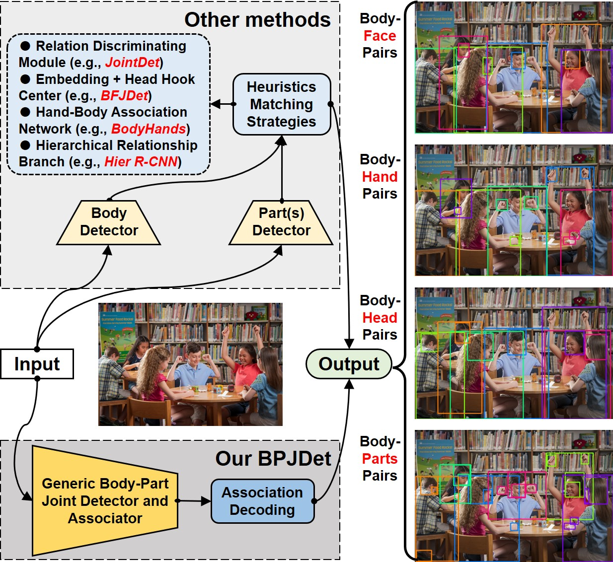
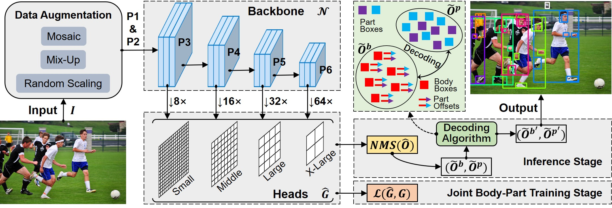

# BPJDetPlus
Codes for my paper "[BPJDet: Extended Object Representation for Generic Body-Part Joint Detection](https://arxiv.org/abs/2304.10765v2)" which is an extended version of our conference paper ICME2023. ***Note: BPJDetPlus is compatible with BPJDet, which means that all tasks in BPJDet can be trained using BPJDetPlus's code, otherwise it is not**.*

<table>
<tr>
<th> Body-Parts by BPJDetPlus - Demo 1 (no tracking) </th>
<th> Body-Parts by BPJDetPlus - Demo 2 (no tracking) </th>
</tr>
<tr>
<td></td>
<td></td> 
</tr>
</table>

***************************************************************

## Paper Abstract
> Detection of human body and its parts (e.g., head or hands) has been intensively studied. However, most of these CNNs-based detectors are trained independently, making it difficult to associate detected parts with body. In this paper, we focus on the joint detection of human body and its corresponding parts. Specifically, we propose a novel extended object representation integrating center-offsets of body parts, and construct a dense one-stage generic Body-Part Joint Detector (BPJDet). In this way, body-part associations are neatly embedded in a unified object representation containing both semantic and geometric contents. Therefore, we can perform multi-loss optimizations to tackle multi-tasks synergistically. BPJDet does not suffer from error-prone post matching, and keeps a better trade-off between speed and accuracy. Furthermore, BPJDet can be generalized to detect any one or more body parts. To verify the superiority of BPJDet, we conduct experiments on three body-part datasets (CityPersons, CrowdHuman and BodyHands) and one body-parts dataset COCOHumanParts. While keeping high detection accuracy, BPJDet achieves state-of-the-art association performance on all datasets comparing with its counterparts. Besides, we show benefits of advanced body-part association capability by improving performance of two representative downstream applications: accurate crowd head detection and hand contact estimation.

***************************************************************

## Table of contents
<!--ts-->
- [Illustrations](#illustrations)
- [Installation](#installation)
- [Dataset Preparing](#dataset-preparing)
  * [CityPersons](#citypersons)
  * [CrowdHuman](#crowdhuman)
  * [BodyHands](#bodyhands)
  * [COCOHumanParts](#cocohumanparts)
  * [CroHD and SCUT-Head](#crohd-and-scut-head)
  * [ContactHands](#contacthands)
- [Training and Testing](#training-and-testing)
  * [Configs](#configs)
  * [Body-Face Task](#body-face-task)
  * [Body-Hand Task](#body-hand-task)
  * [Body-Head Task](#body-head-task)
  * [Body-Parts Task](#body-parts-task)
- [Downstream Applications](#downstream-applications)
  * [Body-Head for Accurate Crowd Counting](#body-head-for-accurate-crowd-counting)
  * [Body-Hand for Hand Contact Estimation](#body-hand-for-hand-contact-estimation)
- [Inference](#inference)
- [References](#references)
- [Licenses](#licenses) 
- [Citation](#citation)
<!--te-->

***************************************************************

## Illustrations

* **Fig. 1.** The illustration of the difference between our proposed single-stage BPJDet and other two-stage body-part joint detection methods (e.g., `JointDet`, `BFJDet`, `BodyHands` and `Hier R-CNN`). Their two-stage refers to training the detection and association modules separately, unlike our one-stage joint detection and association framework. We visualize bodies and parts that belong to the same person using bounding boxes with the same color.


* **Fig. 2.** Our BPJDet adopts YOLOv5 as the backbone to extract features and predict grids from one augmented input image. During training, target grids are used to supervise the elaborately designed multi-loss function. In inference stage, NMS and association decoding algorithm are sequentially applied on predicted objects to obtain final human body boxes set and related body parts set.


***************************************************************

## Installation

* **Environment:** Anaconda, Python3.8, PyTorch1.10.0(CUDA11.2), wandb
```bash
$ git clone -b BPJDetPlus https://github.com/hnuzhy/BPJDet.git
$ pip install -r requirements.txt -i https://pypi.tuna.tsinghua.edu.cn/simple

# Codes are only evaluated on GTX3090 + CUDA11.2 + PyTorch1.10.0.
$ pip3 install torch==1.10.0+cu111 torchvision==0.11.1+cu111 torchaudio==0.10.0+cu111 \
  -f https://download.pytorch.org/whl/cu111/torch_stable.html
```

***************************************************************

## Dataset Preparing

### CityPersons
* *Being suitable to both BPJDet and BPJDetPlus projects.*
* [CityPersons](https://arxiv.org/abs/1702.05693) is a new set of person annotations on top of the [Cityscapes](https://www.cityscapes-dataset.com/) dataset.
* Download images of CityPersons from Cityscapes website https://www.cityscapes-dataset.com/.
* Download annotations from [GoogleDrive](https://drive.google.com/drive/folders/1PxGTo_SE8O56r0qw7DgmR3Lk-eokS0X0), which contains the original body boxes and newly annotated head/face boxes by [BFJDet](https://github.com/AibeeDetect/BFJDet#data-preparing). You will get three json files from the ground-truth folder `instances_train_bhfmatch_new.json`, `instances_val_bhfmatch_new.json` and `instances_val_bf_new.json`.
* Process new annotations of CityPersons provided by BFJDet for our BPJDet task by running `python tools/get_anno_CityPersons.py`.
```bash
# Dataset info stat after processing:
original images [train:val] = [2415:500](2915), and instances [train:val] = [22169:5185]
[person]    (images --> train:val=1847:361, total 2208, instances --> train:val=14762:3439, total 18201)
[head]      (images --> train:val=1847:361, total 2208, instances --> train:val=14554:3400, total 17954)
[face]      (images --> train:val=1846:361, total 2207, instances --> train:val= 6487:1435, total  7922)
```

### CrowdHuman
* *Being suitable to both BPJDet and BPJDetPlus projects.*
* [CrowdHuman](https://www.crowdhuman.org/) is a benchmark dataset focusing on human to better evaluate detectors in crowd scenarios.
* Download images of CrowdHuman from website http://www.crowdhuman.org/.
* Download annotations from [GoogleDrive](https://drive.google.com/drive/folders/1Sk2IAmm_wTVh289RKs5FiU17siWrJJCu), which contains the original body/head boxes and newly annotated face boxes by [BFJDet](https://github.com/AibeeDetect/BFJDet#data-preparing). You will get two json files `instances_train_full_bhf_new.json` and `instances_val_full_bhf_new.json`.
* Process new annotations of CrowdHuman provided by BFJDet for our BPJDet task by running `python tools/get_anno_CrowdHuman.py`.
```bash
# Dataset info stat after processing:
original images [train:val] = [15000:4370](2915), and instances [train:val] = [438792:127716](566508)
[person]    (images --> train:val=15000:4370, instances --> train:val=339565:99481 (439046))
[head]      (images --> train:val=15000:4370, instances --> train:val=339565:99481 (439046))
[face]      (images --> train:val=14690:4282, instances --> train:val=191575:57328 (248903))
```

### BodyHands
* *Being suitable to both BPJDet and BPJDetPlus projects.*
* [BodyHands](http://vision.cs.stonybrook.edu/~supreeth/BodyHands/) is a large-scale dataset, and has images with annotations for hand and body locations and their correspondences.
* Download images and annotations of BodyHands from website http://vision.cs.stonybrook.edu/~supreeth/BodyHands/.
* The original using and training of BodyHands are in https://github.com/cvlab-stonybrook/BodyHands.
* Process official annotations of BodyHands for our BPJDet task by running `python tools/get_anno_BodyHands.py`.
```bash
# Dataset info stat after processing:
original images [train:val] = [18858:1629](20487), and instances [train:val] = [56060:7048](63108)
[person]    (images --> train:val=18858:1629, instances --> train:val=56060:7048 (63108))
[hand]      (images --> train:val=18858:1629, instances --> train:val=51901:5983 (57884))
```

### COCOHumanParts
* *Newly added and only suitable to BPJDetPlus project.*
* [COCOHumanParts](https://github.com/soeaver/Hier-R-CNN#dataset) has inherited bounding-box of person category from official MS-COCO, and labeled the locations of six body-parts (face, head, right-hand/left-hand and right-foot/left-foot) in each instance if it is visible.
* Download images from the MS-COCO official website and annotations of COCOHumanParts from [Google Drive](https://drive.google.com/drive/folders/1pT8aOTlVskaAtMadeAHzRrnxnEIxZbV8).
* Process official annotations of COCOHumanParts for our BPJDetPlus task by running `python tools/get_anno_HumanParts_v2.py`.
```bash
# Dataset info stat after processing:
original images [train:val] = [64115:2693](66808), and instances [train:val] = [257306:10777](268083)
# [After running the get_anno_HumanParts.py script file][fisrtly write in 2023-03-19]
[person]    (images --> train:val=64115:2693, instances --> train:val=257306:10777 (268083))
[parts]     (images --> train:val=63121:2662, instances --> train:val=728394:31044 (759438))
[all]       (images --> train:val=64115:2693, instances --> train:val=985700:41821 (1027521))
# [After running the get_anno_HumanParts_v2.py script file][re-write in 2023-03-20]
[person]    (instances --> train:val    =   257306:10777    (268083))
[head]      (instances --> train:val    =   223049:9351     (232400))
[face]      (instances --> train:val    =   153195:6913     (160108))
[lefthand]  (instances --> train:val    =   96078:4222      (100300))
[righthand] (instances --> train:val    =   100205:4324     (104529))
[leftfoot]  (instances --> train:val    =   77997:3134      ( 81131))
[rightfoot] (instances --> train:val    =   77870:3100      ( 80970))
```

### CroHD and SCUT-Head
* *Newly added and only suitable to BPJDetPlus project. For the downstream application **Body-Head for Accurate Crowd Counting**.*
* The two datasets do not include body boxes, and were originally released for dense head tracking and crowded head detection tasks, respectively. Thus, it is not feasible to train BPJDet/BPJDetPlus directly on them. Instead, we decide to apply *body-head* joint detection models trained on `CrowdHuman` to them in a cross-domain generalization manner. 
* **CroHD Dataset**: [CroHD](https://motchallenge.net/data/Head_Tracking_21/) is collected across 9 HD sequences captured from an elevated viewpoint. All sequences are open scenes like crossings and train stations with super high crowd densities. CroHD only provides annotations in 4 train-set sequences. More details can be found in its [official website](https://project.inria.fr/crowdscience/project/dense-crowd-head-tracking/)
```bash
[CroHD train-set]
#                               Frames  Scenario        Tracks  Boxes       Density
# HT21-01 --> (det, gt, img1)   429     Indoor          85      21,456      50.0
# HT21-02 --> (det, gt, img1)   3,315   Outdoor, night  1,276   733,622     222.0
# HT21-03 --> (det, gt, img1)   1,000   Outdoor, day    811     258,012     258.0
# HT21-04 --> (det, gt, img1)   997     Indoor          580     175,703     176.2
Total Frames: 5741,     Total Boxes: 1188793
```
* **SCUT-Head Dataset**: [SCUT-Head](https://github.com/HCIILAB/SCUT-HEAD-Dataset-Release) has two parts A and B. We utilize the Part_B which mostly focuses on indoor scenes like classrooms and meeting rooms.
```bash
[SCUT_HEAD_Part_A]
Total Frames: 2000,     Total Boxes: 67324
[SCUT_HEAD_Part_B]
Total Frames: 2405,     Total Boxes: 43930
```

### ContactHands
* *Newly added and only suitable to BPJDetPlus project. For the downstream application **Body-Hand for Hand Contact Estimation**.*
* [ContactHands](http://vision.cs.stonybrook.edu/~supreeth/ContactHands_data_website/) is used for improving performance by leveraging the advanced `body-hand` association ability of BPJDetPlus. It is a large-scale dataset of in-the-wild images for hand detection and contact recognition. It has annotations for 20,506 images, of which 18,877 form the train-set and 1,629 form the test-set. There are 52,050 and 5,983 hand instances in train and test sets, respectively. More details can be found in its [official code](https://github.com/cvlab-stonybrook/ContactHands).
* Download zip file of images and annotations of ContactHands from [Google Drive](https://drive.google.com/file/d/1bhl1ZJjkSr3lTP61CNpj6KqIAPCSYJ3q/view). This dataset is built by the same authors of `BodyHands` dataset and has a similar structure with `BodyHands`.
* Process official annotations of ContactHands for our BPJDetPlus task by running `python tools/get_anno_ContactHands.py`.
* For each hand instance, the ContactHands annotates the four contact states by answering No (0), Yes (1), or Unsure (2).
```bash
original images [train:val] = [18877:1629](20506), and hand instances [train:val] = [52050:5983](58033)
left images [train:val] = [18861:1629](20490), and instances [train:val] = [56066:7048](63114)
[person]    (images --> train:val=18858:1629, instances --> train:val=56066:7048 (63114) )
[hand]      (images --> train:val=18858:1629, instances --> train:val=51892:5982 (57874) )

hand_contact_states_cnt for [NC, SC, PC, OC] with [No(0), Yes(1), or Unsure(2)]
train-set:  [[34751, 16496, 645], [41795, 9396, 701], [48962, 2698, 232], [26296, 24994, 602]]
val-set:    [[4329, 1345, 308], [4228, 1388, 366], [5773, 195, 14], [2866, 2976, 140]]
```

***************************************************************

## Training and Testing

### Configs
* **Yaml:** Please refer these `./data/*.yaml` files to config your own .yaml file. Such as the `JointBP_BodyHands.yaml` file for body-hand joint detection task.

* **Pretrained weights:** For YOLOv5 weights, please download the version 5.0 that we have used. And put them under the `./weights/` folder
```
yolov5s6.pt [https://github.com/ultralytics/yolov5/releases/download/v5.0/yolov5s6.pt]
yolov5m6.pt [https://github.com/ultralytics/yolov5/releases/download/v5.0/yolov5m6.pt]
yolov5l6.pt [https://github.com/ultralytics/yolov5/releases/download/v5.0/yolov5l6.pt]
```

### Body-Face Task

* preparing yolov5-style labels for body-face
```bash
# for CityPersons
$ rm -rf /path/to/dataset/CityPersons/yolov5_style_face/
$ cd /path/to/project/BPJDet
$ python utils/labels.py --data data/JointBP_CityPersons_face.yaml
# for CrowdHuman
$ rm -rf /path/to/dataset/CrowdHuman/yolov5_style_face/
$ cd /path/to/project/BPJDet
$ python utils/labels.py --data data/JointBP_CrowdHuman_face.yaml
```

* BPJDet-S (on CityPersons)
```bash
# training (using --noval for faster training)
$ python -m torch.distributed.launch --nproc_per_node 2 train.py --workers 10 --device 0,1 \
    --data data/JointBP_CityPersons_face.yaml --hyp data/hyp-p6.yaml --val-scales 1 --val-flips -1 \
    --weights weights/yolov5s6.pt --project runs/BPJDet --img 1536 --batch 24 --epochs 100 \
    --body_part_w 0.015 --name cps_face_s_1536_e100_mMR --noval
# testing (w/o TTA)
$ python val.py --rect --data data/JointBP_CityPersons_face.yaml --img 1536 \
    --weights runs/JointBP/cps_face_s_1536_e100_mMR/weights/best_mMR.pt \
    --batch-size 8 --device 3
# result
[mMR_all_list]: Reasonable: 0.293, Bare: 0.293, Partial: 0.289, Heavy: 0.572
```
* BPJDet-S (on CrowdHuman)
```bash
# training (using --noval for faster training)
$ python -m torch.distributed.launch --nproc_per_node 3 train.py --workers 15 --device 0,1,2 \
    --data data/JointBP_CrowdHuman_face.yaml --hyp data/hyp-p6.yaml --val-scales 1 --val-flips -1 \
    --weights weights/yolov5s6.pt --project runs/BPJDet --img 1536 --batch 45 --epochs 150 \
    --body_part_w 0.015 --name ch_face_s_1536_e150_mMR --noval
# testing (w/o TTA)
$ python val.py --rect --data data/JointBP_CrowdHuman_face.yaml --img 1536 \
    --weights runs/BPJDet/ch_face_s_1536_e150_mMR/weights/best_mMR.pt \
    --batch-size 8 --device 3
# result
[AP@.5&MR]: AP_body: 0.895, AP_part: 0.808, MR_body: 0.413, MR_part: 0.459, mMR_avg: 0.668
[mMR_list]: Reasonable: 0.514, Small: 0.711, Heavy: 0.838, All: 0.607
```

* BPJDet-M (on CityPersons)
```bash
# training (using --noval for faster training)
$ python -m torch.distributed.launch --nproc_per_node 2 train.py --workers 10 --device 0,1 \
    --data data/JointBP_CityPersons_face.yaml --hyp data/hyp-p6.yaml --val-scales 1 --val-flips -1 \
    --weights weights/yolov5m6.pt --project runs/BPJDet --img 1536 --batch 20 --epochs 100 \
    --body_part_w 0.015 --name cps_face_m_1536_e100_mMR --noval
# testing (w/o TTA)
$ python val.py --rect --data data/JointBP_CityPersons_face.yaml --img 1536 \
    --weights runs/BPJDet/cps_face_m_1536_e100_mMR/weights/best_mMR.pt \
    --batch-size 8 --device 3
# result
[mMR_all_list]: Reasonable: 0.275, Bare: 0.249, Partial: 0.316, Heavy: 0.558
```
* BPJDet-M (on CrowdHuman)
```bash
# training (using --noval for faster training)
$ python -m torch.distributed.launch --nproc_per_node 3 train.py --workers 15 --device 0,1,2 \
    --data data/JointBP_CrowdHuman_face.yaml --hyp data/hyp-p6.yaml --val-scales 1 --val-flips -1 \
    --weights weights/yolov5m6.pt --project runs/BPJDet --img 1536 --batch 30 --epochs 150 \
    --body_part_w 0.015 --name ch_face_m_1536_e150_mMR --noval
# testing (w/o TTA)
$ python val.py --rect --data data/JointBP_CrowdHuman_face.yaml --img 1536 \
    --weights runs/BPJDet/ch_face_m_1536_e150_mMR/weights/best_mMR.pt \
    --batch-size 8 --device 3
# result
[AP@.5&MR]: AP_body: 0.907, AP_part: 0.822, MR_body: 0.397, MR_part: 0.450, mMR_avg: 0.662
[mMR_list]: Reasonable: 0.506, Small: 0.692, Heavy: 0.844, All: 0.607
```

* BPJDet-L (on CityPersons)
```bash
# training (using --noval for faster training)
$ python -m torch.distributed.launch --nproc_per_node 2 train.py --workers 10 --device 0,1 \
    --data data/JointBP_CityPersons_face.yaml --hyp data/hyp-p6.yaml --val-scales 1 --val-flips -1 \
    --weights weights/yolov5l6.pt --project runs/BPJDet --img 1536 --batch 12 --epochs 100 \
    --body_part_w 0.015 --name cps_face_l_1536_e100_mMR --noval
# testing (w/o TTA)
$ python val.py --rect --data data/JointBP_CityPersons_face.yaml --img 1536 \
    --weights runs/BPJDet/cps_face_l_1536_e100_mMR/weights/best_mMR.pt \
    --batch-size 6 --device 3
# result
[mMR_all_list]: Reasonable: 0.264, Bare: 0.255, Partial: 0.277, Heavy: 0.462
```
* BPJDet-L (on CrowdHuman)
```bash
# training (using --noval for faster training)
$ python -m torch.distributed.launch --nproc_per_node 3 train.py --workers 15 --device 0,1,2 \
    --data data/JointBP_CrowdHuman_face.yaml --hyp data/hyp-p6.yaml --val-scales 1 --val-flips -1 \
    --weights weights/yolov5l6.pt --project runs/BPJDet --img 1536 --batch 18 --epochs 150 \
    --body_part_w 0.015 --name ch_face_l_1536_e150_mMR --noval
# testing (w/o TTA)
$ python val.py --rect --data data/JointBP_CrowdHuman_face.yaml --img 1536 \
    --weights runs/BPJDet/ch_face_l_1536_e150_mMR/weights/best_mMR.pt \
    --batch-size 8 --device 3
# result
[AP@.5&MR]: AP_body: 0.895, AP_part: 0.816, MR_body: 0.407, MR_part: 0.463, mMR_avg: 0.657
[mMR_list]: Reasonable: 0.501, Small: 0.688, Heavy: 0.834, All: 0.604
```


### Body-Hand Task

* preparing yolov5-style labels for body-hand
```bash
$ rm -rf /path/to/dataset/BodyHands/yolov5_style_hand/
$ cd /path/to/project/BPJDet
$ python utils/labels.py --data data/JointBP_BodyHands.yaml
```

* BPJDet-S (on BodyHands)
```bash
# training (using --noval for faster training)
$ python -m torch.distributed.launch --nproc_per_node 3 train.py --workers 15 --device 0,1,2 \
    --data data/JointBP_BodyHands.yaml --hyp data/hyp-p6.yaml --val-scales 1 --val-flips -1 \
    --weights weights/yolov5s6.pt --project runs/BPJDet --img 1536 --batch 45 --epochs 100 \
    --body_part_w 0.015 --name bh_hand_s_1536_e100 --noval
# testing (w/o TTA)
$ python val.py --rect --data data/JointBP_BodyHands.yaml --img 1536 \
    --weights runs/BPJDet/bh_hand_s_1536_e100/weights/best.pt --batch-size 8 --device 3
# result
###### bodypart bbox mAP: 8063
 Average Precision  (AP) @[ IoU=0.50      | area=   all | maxDets=100 ] = 0.840
Body Accuracy corresponding to Dual Metric is: 85.6762
AP_Dual(Joint-AP): 77.856, AP_Single: 62.743
```

* BPJDet-M (on BodyHands)
```bash
# training (using --noval for faster training)
$ python -m torch.distributed.launch --nproc_per_node 3 train.py --workers 15 --device 0,1,2 \
    --data data/JointBP_BodyHands.yaml --hyp data/hyp-p6.yaml --val-scales 1 --val-flips -1 \
    --weights weights/yolov5m6.pt --project runs/BPJDet --img 1536 --batch 30 --epochs 100 \
    --body_part_w 0.015 --name bh_hand_m_1536_e100 --noval
# testing (w/o TTA)
$ python val.py --rect --data data/JointBP_BodyHands.yaml --img 1536 \
    --weights runs/BPJDet/bh_hand_m_1536_e100/weights/best.pt --batch-size 8 --device 3
# result
###### bodypart bbox mAP: 8077
 Average Precision  (AP) @[ IoU=0.50      | area=   all | maxDets=100 ] = 0.853
Body Accuracy corresponding to Dual Metric is: 86.8009
AP_Dual(Joint-AP): 78.133, AP_Single: 63.243
```

* BPJDet-L (on BodyHands)
```bash
# training (using --noval for faster training)
$ python -m torch.distributed.launch --nproc_per_node 3 train.py --workers 15 --device 0,1,2 \
    --data data/JointBP_BodyHands.yaml --hyp data/hyp-p6.yaml --val-scales 1 --val-flips -1 \
    --weights weights/yolov5l6.pt --project runs/BPJDet --img 1536 --batch 18 --epochs 100 \
    --body_part_w 0.015 --name bh_hand_l_1536_e100 --noval
# testing (w/o TTA)
$ python val.py --rect --data data/JointBP_BodyHands.yaml --img 1536 \
    --weights runs/BPJDet/bh_hand_l_1536_e100/weights/best.pt --batch-size 8 --device 3 
# result
###### bodypart bbox mAP: 8184
 Average Precision  (AP) @[ IoU=0.50      | area=   all | maxDets=100 ] = 0.859
Body Accuracy corresponding to Dual Metric is: 86.905
AP_Dual(Joint-AP): 84.385, AP_Single: 63.589
```


### Body-Head Task

* preparing yolov5-style labels for body-head
```bash
$ rm -rf /path/to/dataset/CrowdHuman/yolov5_style_head/
$ cd /path/to/project/BPJDet
$ python utils/labels.py --data data/JointBP_CrowdHuman_head.yaml
```

* BPJDet-S (on CrowdHuman)
```bash
# training (using --noval for faster training)
$ python -m torch.distributed.launch --nproc_per_node 3 train.py --workers 15 --device 0,1,2 \
    --data data/JointBP_CrowdHuman_head.yaml --hyp data/hyp-p6.yaml --val-scales 1 --val-flips -1 \
    --weights weights/yolov5s6.pt --project runs/BPJDet --img 1536 --batch 45 --epochs 150 \
    --body_part_w 0.015 --name ch_head_s_1536_e150_mMR --noval
# testing (w/o TTA)
$ python val.py --rect --data data/JointBP_CrowdHuman_head.yaml --img 1536 \
    --weights runs/BPJDet/ch_head_s_1536_e150_mMR/weights/best_mMR.pt --batch-size 8 --device 3
# result
[AP@.5&MR]: AP_body: 0.824, AP_part: 0.771, MR_body: 0.459, MR_part: 0.478, mMR_avg: 0.661
[mMR_list]: Reasonable: 0.480, Small: 0.613, Heavy: 0.869, All: 0.682
```

* BPJDet-M (on CrowdHuman)
```bash
# training (using --noval for faster training)
$ python -m torch.distributed.launch --nproc_per_node 3 train.py --workers 15 --device 0,1,2 \
    --data data/JointBP_CrowdHuman_head.yaml --hyp data/hyp-p6.yaml --val-scales 1 --val-flips -1 \
    --weights weights/yolov5m6.pt --project runs/BPJDet --img 1536 --batch 30 --epochs 150 \
    --body_part_w 0.015 --name ch_head_m_1536_e150_mMR --noval
# testing (w/o TTA)
$ python val.py --rect --data data/JointBP_CrowdHuman_head.yaml --img 1536 \
    --weights runs/BPJDet/ch_head_m_1536_e150_mMR/weights/best_mMR.pt --batch-size 8 --device 3
# result
[AP@.5&MR]: AP_body: 0.828, AP_part: 0.777, MR_body: 0.454, MR_part: 0.468, mMR_avg: 0.648
[mMR_list]: Reasonable: 0.461, Small: 0.596, Heavy: 0.869, All: 0.665
```

* BPJDet-L (on CrowdHuman)
```bash
# training (using --noval for faster training)
$ python -m torch.distributed.launch --nproc_per_node 3 train.py --workers 15 --device 0,1,2 \
    --data data/JointBP_CrowdHuman_head.yaml --hyp data/hyp-p6.yaml --val-scales 1 --val-flips -1 \
    --weights weights/yolov5l6.pt --project runs/BPJDet --img 1536 --batch 18 --epochs 150 \
    --body_part_w 0.015 --name ch_head_l_1536_e150_mMR
# testing (w/o TTA)
$ python val.py --rect --data data/JointBP_CrowdHuman_head.yaml --img 1536 \
    --weights runs/BPJDet/ch_head_l_1536_e150_mMR/weights/best_mMR.pt --batch-size 8 --device 3
# result
[AP@.5&MR]: AP_body: 0.811, AP_part: 0.761, MR_body: 0.462, MR_part: 0.480, mMR_avg: 0.645
[mMR_list]: Reasonable: 0.464, Small: 0.582, Heavy: 0.864, All: 0.670
```


### Body-Parts Task

* *Only suitable to the BPJDetPlus project.*
* preparing yolov5-style labels for body-parts
```bash
$ rm -rf /path/to/dataset/COCOHumanParts/yolov5_style_parts/
$ cd /path/to/project/BPJDetPlus
$ python utils/labels.py --data data/JointBP_HumanParts.yaml
```

* BPJDetPlus-S (on COCOHumanParts)
```bash
# training (using --noval for faster training)
$ python -m torch.distributed.launch --nproc_per_node 3 train.py --workers 15 --device 0,1,2 \
    --data data/JointBP_HumanParts.yaml --hyp data/hyp-p6.yaml --val-scales 1 --val-flips -1 \
    --weights weights/yolov5s6.pt --project runs/BPJDetPlus --img 1536 --batch 45 --epochs 150 \
    --body_part_w 0.015 --name hp_parts_s_1536_e150_mMR
# testing (w/o TTA)
$ python val.py --rect --data data/JointBP_HumanParts.yaml --img 1536 \
    --weights runs/BPJDetPlus/hp_parts_s_1536_e150_mMR/weights/best_mMR.pt --batch-size 8 --device 3
# result of best_mMR.pt 
(mAP@0.5:0.95, mAP@0.5, mAP@0.75, mAP@0.5:0.95/Small, mAP@0.5:0.95/Medium, mAP@0.5:0.95/Large, num)
Per Category AP@s (person):      0.5627, 0.8057, 0.6140, 0.3107, 0.5730, 0.7165; 22692
Per Category AP@s (head):        0.5337, 0.7929, 0.5880, 0.4094, 0.7369, 0.7967; 11474
Per Category AP@s (face):        0.4161, 0.6634, 0.4556, 0.3230, 0.7318, 0.7383; 7296
Per Category AP@s (lefthand):    0.3304, 0.5714, 0.3385, 0.2671, 0.5925, 0.4393; 4199
Per Category AP@s (righthand):   0.3376, 0.5742, 0.3529, 0.2723, 0.5848, 0.4997; 4270
Per Category AP@s (leftfoot):    0.2568, 0.5588, 0.1910, 0.2148, 0.4225, 0.1194; 3300
Per Category AP@s (rightfoot):   0.2485, 0.5438, 0.1835, 0.2096, 0.4001, 0.0117; 3268
All Category AP@s (all):         0.3837, 0.6443, 0.3891, 0.2867, 0.5774, 0.4745; 33807
**************************************************************************************
Per Category AP@a (person):      0.5627, 0.8057, 0.6140, 0.3107, 0.5730, 0.7165; 22692
Per Category AP@a (head):        0.5351, 0.8001, 0.5884, 0.4108, 0.7399, 0.8030; 11705
Per Category AP@a (face):        0.4187, 0.6706, 0.4567, 0.3245, 0.7368, 0.7449; 7488
Per Category AP@a (lefthand):    0.3372, 0.5831, 0.3486, 0.2713, 0.6123, 0.4506; 4694
Per Category AP@a (righthand):   0.3466, 0.5876, 0.3604, 0.2772, 0.6055, 0.5416; 4775
Per Category AP@a (leftfoot):    0.2649, 0.5757, 0.1961, 0.2181, 0.4464, 0.1740; 3705
Per Category AP@a (rightfoot):   0.2547, 0.5623, 0.1900, 0.2127, 0.4223, 0.0460; 3660
All Category AP@a (all):         0.3885, 0.6550, 0.3935, 0.2893, 0.5909, 0.4967; 36027
[AP@.5&MR]: AP_body: 0.808, AP_part: 0.804, MR_body: 0.475, MR_part: 0.419, mMR_avg: 0.334
[mMR_list]: Reasonable: 0.298, Small: 0.411, Heavy: -1.000, All: 0.293
```

* BPJDetPlus-M (on COCOHumanParts)
```bash
# training (using --noval for faster training)
$ python -m torch.distributed.launch --nproc_per_node 3 train.py --workers 12 --device 0,1,2 \
    --data data/JointBP_HumanParts.yaml --hyp data/hyp-p6.yaml --val-scales 1 --val-flips -1 \
    --weights weights/yolov5m6.pt --project runs/BPJDetPlus --img 1536 --batch 30 --epochs 150 \
    --body_part_w 0.015 --name hp_parts_m_1536_e150_mMR
# testing (w/o TTA)
$ python val.py --rect --data data/JointBP_HumanParts.yaml --img 1536 \
    --weights runs/BPJDetPlus/hp_parts_m_1536_e150_mMR/weights/best_mMR.pt --batch-size 8 --device 3
# result of best_mMR.pt 
(mAP@0.5:0.95, mAP@0.5, mAP@0.75, mAP@0.5:0.95/Small, mAP@0.5:0.95/Medium, mAP@0.5:0.95/Large, num)
Per Category AP@s (person):      0.5984, 0.8212, 0.6526, 0.3431, 0.5934, 0.7606; 21800
Per Category AP@s (head):        0.5547, 0.8176, 0.6178, 0.4362, 0.7508, 0.8132; 11904
Per Category AP@s (face):        0.4450, 0.6889, 0.4969, 0.3536, 0.7502, 0.7516; 7544
Per Category AP@s (lefthand):    0.3702, 0.6129, 0.3869, 0.3029, 0.6432, 0.5229; 4489
Per Category AP@s (righthand):   0.3805, 0.6226, 0.3968, 0.3082, 0.6499, 0.5512; 4601
Per Category AP@s (leftfoot):    0.2855, 0.6052, 0.2245, 0.2377, 0.4669, 0.2036; 3538
Per Category AP@s (rightfoot):   0.2809, 0.6016, 0.2289, 0.2376, 0.4539, 0.1030; 3522
All Category AP@s (all):         0.4165, 0.6814, 0.4292, 0.3170, 0.6155, 0.5294; 35598
**************************************************************************************
Per Category AP@a (person):      0.5984, 0.8212, 0.6526, 0.3431, 0.5934, 0.7606; 21800
Per Category AP@a (head):        0.5566, 0.8174, 0.6180, 0.4361, 0.7525, 0.8163; 12120
Per Category AP@a (face):        0.4469, 0.6894, 0.4978, 0.3549, 0.7541, 0.7559; 7730
Per Category AP@a (lefthand):    0.3764, 0.6241, 0.3927, 0.3069, 0.6529, 0.5506; 4938
Per Category AP@a (righthand):   0.3873, 0.6343, 0.4026, 0.3121, 0.6624, 0.6125; 5081
Per Category AP@a (leftfoot):    0.2915, 0.6224, 0.2286, 0.2425, 0.4808, 0.1871; 3963
Per Category AP@a (rightfoot):   0.2856, 0.6131, 0.2323, 0.2421, 0.4616, 0.1396; 3902
All Category AP@a (all):         0.4204, 0.6888, 0.4321, 0.3197, 0.6225, 0.5461; 37734
[AP@.5&MR]: AP_body: 0.824, AP_part: 0.824, MR_body: 0.454, MR_part: 0.406, mMR_avg: 0.297
[mMR_list]: Reasonable: 0.266, Small: 0.363, Heavy: -1.000, All: 0.262
```

* BPJDetPlus-L (on COCOHumanParts)
```bash
# training (using --noval for faster training)
$ python -m torch.distributed.launch --nproc_per_node 3 train.py --workers 12 --device 0,1,2 \
    --data data/JointBP_HumanParts.yaml --hyp data/hyp-p6.yaml --val-scales 1 --val-flips -1 \
    --weights weights/yolov5l6.pt --project runs/BPJDetPlus --img 1536 --batch 18 --epochs 150 \
    --body_part_w 0.015 --name hp_parts_l_1536_e150_mMR
# testing (w/o TTA)
$ python val.py --rect --data data/JointBP_HumanParts.yaml --img 1536 \
    --weights runs/BPJDetPlus/hp_parts_l_1536_e150_mMR/weights/best_mMR.pt --batch-size 8 --device 3
# result of best_mMR.pt
(mAP@0.5:0.95, mAP@0.5, mAP@0.75, mAP@0.5:0.95/Small, mAP@0.5:0.95/Medium, mAP@0.5:0.95/Large, num)
Per Category AP@s (person):      0.6126, 0.8262, 0.6664, 0.3624, 0.5988, 0.7795; 20422
Per Category AP@s (head):        0.5639, 0.8176, 0.6278, 0.4423, 0.7608, 0.8274; 11763
Per Category AP@s (face):        0.4615, 0.6996, 0.5169, 0.3690, 0.7640, 0.7789; 7564
Per Category AP@s (lefthand):    0.3907, 0.6395, 0.4102, 0.3234, 0.6605, 0.5937; 4583
Per Category AP@s (righthand):   0.3957, 0.6401, 0.4163, 0.3258, 0.6574, 0.5777; 4753
Per Category AP@s (leftfoot):    0.3054, 0.6366, 0.2524, 0.2530, 0.5067, 0.3421; 3608
Per Category AP@s (rightfoot):   0.2976, 0.6256, 0.2394, 0.2494, 0.4759, 0.2246; 3581
All Category AP@s (all):         0.4325, 0.6979, 0.4471, 0.3322, 0.6320, 0.5891; 35852
**************************************************************************************
Per Category AP@a (person):      0.6126, 0.8262, 0.6664, 0.3624, 0.5988, 0.7795; 20422
Per Category AP@a (head):        0.5656, 0.8244, 0.6279, 0.4433, 0.7607, 0.8323; 11931
Per Category AP@a (face):        0.4633, 0.7066, 0.5176, 0.3726, 0.7670, 0.7875; 7767
Per Category AP@a (lefthand):    0.3960, 0.6502, 0.4158, 0.3274, 0.6691, 0.6162; 4990
Per Category AP@a (righthand):   0.4040, 0.6478, 0.4284, 0.3293, 0.6712, 0.6698; 5115
Per Category AP@a (leftfoot):    0.3091, 0.6476, 0.2552, 0.2566, 0.5121, 0.3397; 3915
Per Category AP@a (rightfoot):   0.3024, 0.6376, 0.2432, 0.2526, 0.4847, 0.2978; 3861
All Category AP@a (all):         0.4362, 0.7058, 0.4506, 0.3349, 0.6377, 0.6175; 37579
[AP@.5&MR]: AP_body: 0.829, AP_part: 0.826, MR_body: 0.445, MR_part: 0.409, mMR_avg: 0.308
[mMR_list]: Reasonable: 0.268, Small: 0.392, Heavy: -1.000, All: 0.263
```

***************************************************************

## Downstream Applications

### Body-Head for Accurate Crowd Counting

> Our proposed BPJDet/BPJDetPlus can predict body-head pairs rather than just apply head detection. To reduce `false positives`, we can utilize these pairs to perform a double check, retaining only candidates who detect body and head. Using this strategy, we can greatly `improve precision` and `slightly increase F1 scores` with `minimal recall and mAP decreases` in three test sets: `CroHD train-set`, `SCUT_HEAD_Part_B` and `CrowdHuman val-set`.

* Validation on CroHD train-set
```bash
[BPJDet-S]
$ python demos/eval_CroHD.py --weights runs/JointBPs/ch_head_s_1536_e150_mMR/weights/best_mMR.pt \
    --root-path /path/to/dataset/HeadDetection/HeadTracking21/train/ \
    --data data/JointBP_CrowdHuman_head.yaml --imgsz 1536 --conf-thres 0.2 --iou-thres 0.75 --device 3
[**result**][--conf-thres 0.2][selected]  <----
bbox number in gt_dict: 1188496
bbox number in pd_dict_v1 (using body_association): 904118
bbox number in pd_dict_v2 (not using body_association): 1179569
{'p': 0.61515, 'r': 0.46796, 'f1': 0.53155, 'moda': 0.66995, 'modp': 0.41974, 'AP': 0.34651}
{'p': 0.49869, 'r': 0.49494, 'f1': 0.51095, 'moda': 0.4782, 'modp': 0.42859, 'AP': 0.3585}

[BPJDet-M]
$ python demos/eval_CroHD.py --weights runs/JointBPs/ch_head_m_1536_e150_mMR/weights/best_mMR.pt \
    --root-path /path/to/dataset/HeadDetection/HeadTracking21/train/ \
    --data data/JointBP_CrowdHuman_head.yaml --imgsz 1536 --conf-thres 0.2 --iou-thres 0.75 --device 3
[**result**][--conf-thres 0.2][selected]  <----
bbox number in gt_dict: 1188496
bbox number in pd_dict_v1 (using body_association): 842134
bbox number in pd_dict_v2 (not using body_association): 1032122
{'p': 0.62381, 'r': 0.44202, 'f1': 0.51741, 'moda': 0.64915, 'modp': 0.40077, 'AP': 0.321}
{'p': 0.53275, 'r': 0.46266, 'f1': 0.5002, 'moda': 0.52194, 'modp': 0.40923, 'AP': 0.33084}

[BPJDet-L]
$ python demos/eval_CroHD.py --weights runs/JointBPs/ch_head_l_1536_e150_mMR/weights/best_mMR.pt \
    --root-path /path/to/dataset/HeadDetection/HeadTracking21/train/ \
    --data data/JointBP_CrowdHuman_head.yaml --imgsz 1536 --conf-thres 0.2 --iou-thres 0.75 --device 3
[**result**][--conf-thres 0.2][selected]  <----
bbox number in gt_dict: 1188496
bbox number in pd_dict_v1 (using body_association): 761594
bbox number in pd_dict_v2 (not using body_association): 860647
{'p': 0.64315, 'r': 0.41213, 'f1': 0.50235, 'moda': 0.61777, 'modp': 0.37639, 'AP': 0.3086}
{'p': 0.58233, 'r': 0.42169, 'f1': 0.48952, 'moda': 0.54452, 'modp': 0.37981, 'AP': 0.31313}
```

* Validation on SCUT_HEAD_Part_B
```bash
[BPJDet-S]
$ python demos/eval_SCUTHead.py --weights runs/JointBPs/ch_head_s_1536_e150_mMR/weights/best_mMR.pt \
    --root-path /path/to/dataset/HeadDetection/ \
    --data data/JointBP_CrowdHuman_head.yaml --imgsz 1536 --conf-thres 0.2 --iou-thres 0.75 --device 3
[**result**][--conf-thres 0.2][selected]  <----
bbox number in gt_dict: 43930
bbox number in pd_dict_v1 (using body_association): 39704
bbox number in pd_dict_v2 (not using body_association): 43365
{'p': 0.90427, 'r': 0.81728, 'f1': 0.85908, 'moda': 0.82682, 'modp': 0.6865, 'AP': 0.80464}
{'p': 0.84455, 'r': 0.83369, 'f1': 0.85315, 'moda': 0.77859, 'modp': 0.69874, 'AP': 0.8184}

[BPJDet-M]
$ python demos/eval_SCUTHead.py --weights runs/JointBPs/ch_head_m_1536_e150_mMR/weights/best_mMR.pt \
    --root-path /path/to/dataset/HeadDetection/ \
    --data data/JointBP_CrowdHuman_head.yaml --imgsz 1536 --conf-thres 0.2 --iou-thres 0.75 --device 3
[**result**][--conf-thres 0.2][selected]  <----
bbox number in gt_dict: 43930
bbox number in pd_dict_v1 (using body_association): 39231
bbox number in pd_dict_v2 (not using body_association): 43218
{'p': 0.9062, 'r': 0.80926, 'f1': 0.855, 'moda': 0.82202, 'modp': 0.68389, 'AP': 0.79631}
{'p': 0.84203, 'r': 0.82839, 'f1': 0.84753, 'moda': 0.76872, 'modp': 0.697, 'AP': 0.81203}

[BPJDet-L]
$ python demos/eval_SCUTHead.py --weights runs/JointBPs/ch_head_l_1536_e150_mMR/weights/best_mMR.pt \
    --root-path /path/to/dataset/HeadDetection/ \
    --data data/JointBP_CrowdHuman_head.yaml --imgsz 1536 --conf-thres 0.2 --iou-thres 0.75 --device 3
[**result**][--conf-thres 0.2][selected]  <----
bbox number in gt_dict: 43930
bbox number in pd_dict_v1 (using body_association): 38010
bbox number in pd_dict_v2 (not using body_association): 41506
{'p': 0.91692, 'r': 0.79335, 'f1': 0.85084, 'moda': 0.82193, 'modp': 0.66737, 'AP': 0.78227}
{'p': 0.85111, 'r': 0.80414, 'f1': 0.84336, 'moda': 0.76964, 'modp': 0.67663, 'AP': 0.79107}
```

* Validation on CrowdHuman val-set
```bash
[BPJDet-S]
$ python demos/eval_CrowdHuman.py --weights runs/JointBP/ch_head_s_1536_e150_mMR/weights/best_mMR.pt \
    --root-path /path/to/dataset/CrowdHuman/ \
    --data data/JointBP_CrowdHuman_head.yaml --imgsz 1536 --conf-thres 0.5 --iou-thres 0.75 --device 3
[**result**][--conf-thres 0.2][selected]  <----
bbox number in gt_dict: 99481
bbox number in pd_dict_v1 (using body_association): 100195
bbox number in pd_dict_v2 (not using body_association): 119206
{'p': 0.81079, 'r': 0.81661, 'f1': 0.82584, 'moda': 0.73014, 'modp': 0.73721, 'AP': 0.79002}
{'p': 0.69691, 'r': 0.83509, 'f1': 0.82009, 'moda': 0.60771, 'modp': 0.74728, 'AP': 0.80203}

[BPJDet-M]
$ python demos/eval_CrowdHuman.py --weights runs/JointBP/ch_head_m_1536_e150_mMR/weights/best_mMR.pt \
    --root-path /path/to/dataset/CrowdHuman/ \
    --data data/JointBP_CrowdHuman_head.yaml --imgsz 1536 --conf-thres 0.2 --iou-thres 0.75 --device 3
[**result**][--conf-thres 0.2][selected]  <----
bbox number in gt_dict: 99481
bbox number in pd_dict_v1 (using body_association): 98678
bbox number in pd_dict_v2 (not using body_association): 115574
{'p': 0.82596, 'r': 0.81929, 'f1': 0.83133, 'moda': 0.74814, 'modp': 0.73941, 'AP': 0.79508}
{'p': 0.72059, 'r': 0.83715, 'f1': 0.82452, 'moda': 0.64008, 'modp': 0.74923, 'AP': 0.8069}

[BPJDet-L]
$ python demos/eval_CrowdHuman.py --weights runs/JointBP/ch_head_l_1536_e150_mMR/weights/best_mMR.pt \
    --root-path /path/to/dataset/CrowdHuman/ \
    --data data/JointBP_CrowdHuman_head.yaml --imgsz 1536 --conf-thres 0.2 --iou-thres 0.75 --device 3
[**result**][--conf-thres 0.2][selected]  <----
bbox number in gt_dict: 99481
bbox number in pd_dict_v1 (using body_association): 93442
bbox number in pd_dict_v2 (not using body_association): 105941
{'p': 0.85494, 'r': 0.80304, 'f1': 0.8306, 'moda': 0.75639, 'modp': 0.72851, 'AP': 0.77853}
{'p': 0.76588, 'r': 0.81561, 'f1': 0.82016, 'moda': 0.68431, 'modp': 0.73647, 'AP': 0.78643}
```

### Body-Hand for Hand Contact Estimation

> Following the test setting of physical contact analysis in `BodyHands`, we here explore the benefits of body-hand joint detection using BPJDet for recognizing or estimating the `physical contact state of a hand` on dataset `ContactHands`. ContactHands has defined four contact states: `No-Contact`, `Self-Contact`, `Person-Contact` and `Object-Contact`. We build a new architecture by extending the proposed object representation with additional spaces in `BPJDet` to estimate the contact state of a detected hand. We rename this new framework as `BPJDetPlus`.

* *Only suitable to the BPJDetPlus project.*
* preparing yolov5-style labels for body-hand Contact Estimation
```bash
$ rm -rf /path/to/dataset/ContactHands/yolov5_style_handcontact/
$ cd /path/to/project/BPJDetPlus
$ python utils/labels.py --data data/JointBP_ContactHands.yaml
```

* BPJDetPlus-S (on ContactHands)
```bash
# training (using --noval for faster training)
$ python -m torch.distributed.launch --nproc_per_node 3 train.py --workers 15 --device 0,1,2 \
    --data data/JointBP_ContactHands.yaml --hyp data/hyp-p6.yaml --val-scales 1 --val-flips -1 \
    --weights weights/yolov5s6.pt --project runs/BPJDetPlus --img 1536 --batch 45 --epochs 100 \
    --body_part_w 0.015 --contact_w 0.01 --name ch_contact_s_1536_e100
# testing (w/o TTA)
$ python val.py --rect --data data/JointBP_ContactHands.yaml --img 1536 \
    --weights runs/BPJDetPlus/ch_contact_s_1536_e100/weights/best.pt --batch-size 8 --device 3
# result
###### person bbox mAP: 13980
 Average Precision  (AP) @[ IoU=0.50:0.95 | area=   all | maxDets=100 ] = 0.504
 Average Precision  (AP) @[ IoU=0.50      | area=   all | maxDets=100 ] = 0.797
 Average Precision  (AP) @[ IoU=0.75      | area=   all | maxDets=100 ] = 0.547
###### bodypart bbox mAP: 8114
 Average Precision  (AP) @[ IoU=0.50:0.95 | area=   all | maxDets=100 ] = 0.370
 Average Precision  (AP) @[ IoU=0.50      | area=   all | maxDets=100 ] = 0.831
 Average Precision  (AP) @[ IoU=0.75      | area=   all | maxDets=100 ] = 0.245
[ContactHands]: using many <APs> and <mAP> instead of <MR_body>, <MR_part> and <mMR> !
APs(hand; NC, SC, PC, OC): 0.7768; 0.5887, 0.5469, 0.4551, 0.6662, mAP: 0.5642
```

* BPJDetPlus-M (on ContactHands)
```bash
# training (using --noval for faster training)
$ python -m torch.distributed.launch --nproc_per_node 3 train.py --workers 15 --device 0,1,2 \
    --data data/JointBP_ContactHands.yaml --hyp data/hyp-p6.yaml --val-scales 1 --val-flips -1 \
    --weights weights/yolov5m6.pt --project runs/BPJDetPlus --img 1536 --batch 30 --epochs 100 \
    --body_part_w 0.015 --contact_w 0.01 --name ch_contact_m_1536_e100
# testing (w/o TTA)
$ python val.py --rect --data data/JointBP_ContactHands.yaml --img 1536 \
    --weights runs/BPJDetPlus/ch_contact_m_1536_e100/weights/best.pt --batch-size 8 --device 3
# result
###### person bbox mAP: 14303
 Average Precision  (AP) @[ IoU=0.50:0.95 | area=   all | maxDets=100 ] = 0.554
 Average Precision  (AP) @[ IoU=0.50      | area=   all | maxDets=100 ] = 0.821
 Average Precision  (AP) @[ IoU=0.75      | area=   all | maxDets=100 ] = 0.603
###### bodypart bbox mAP: 8592
 Average Precision  (AP) @[ IoU=0.50:0.95 | area=   all | maxDets=100 ] = 0.387
 Average Precision  (AP) @[ IoU=0.50      | area=   all | maxDets=100 ] = 0.844
 Average Precision  (AP) @[ IoU=0.75      | area=   all | maxDets=100 ] = 0.276
[ContactHands]: using many <APs> and <mAP> instead of <MR_body>, <MR_part> and <mMR> !
APs(hand; NC, SC, PC, OC): 0.7744; 0.6267, 0.5616, 0.4633, 0.6748, mAP: 0.5816
```

* BPJDetPlus-L (on ContactHands)
```bash
# training (using --noval for faster training)
$ python -m torch.distributed.launch --nproc_per_node 3 train.py --workers 15 --device 0,1,2 \
    --data data/JointBP_ContactHands.yaml --hyp data/hyp-p6.yaml --val-scales 1 --val-flips -1 \
    --weights weights/yolov5l6.pt --project runs/BPJDetPlus --img 1536 --batch 18 --epochs 100 \
    --body_part_w 0.015 --contact_w 0.01 --name ch_contact_l_1536_e100
# testing (w/o TTA)
$ python val.py --rect --data data/JointBP_ContactHands.yaml --img 1536 \
    --weights runs/BPJDetPlus/ch_contact_l_1536_e100/weights/best.pt --batch-size 8 --device 3
# result
###### person bbox mAP: 13973
 Average Precision  (AP) @[ IoU=0.50:0.95 | area=   all | maxDets=100 ] = 0.577
 Average Precision  (AP) @[ IoU=0.50      | area=   all | maxDets=100 ] = 0.831
 Average Precision  (AP) @[ IoU=0.75      | area=   all | maxDets=100 ] = 0.626
###### bodypart bbox mAP: 8429
 Average Precision  (AP) @[ IoU=0.50:0.95 | area=   all | maxDets=100 ] = 0.399
 Average Precision  (AP) @[ IoU=0.50      | area=   all | maxDets=100 ] = 0.848
 Average Precision  (AP) @[ IoU=0.75      | area=   all | maxDets=100 ] = 0.289
[ContactHands]: using many <APs> and <mAP> instead of <MR_body>, <MR_part> and <mMR> !
APs(hand; NC, SC, PC, OC): 0.8406; 0.6298, 0.5739, 0.5032, 0.6955, mAP: 0.6006
```


***************************************************************

## Inference

* For single image or multiple images under one folder using `./demos/image.py`
```bash
# single image. Taking body-head joint detection as an example.
$ python demos/image.py --weights runs/BPJDet/ch_head_l_1536_e150_mMR/weights/best_mMR.pt \
    --data data/JointBP_CrowdHuman_head.yaml --imgsz 1536 --conf-thres 0.45 --iou-thres 0.75 \
    --match-iou 0.6 --img-path test_imgs/CrowdHuman/273271,1e59400094ef5d82.jpg --device 3
$ python demos/image.py --weights runs/BPJDet/ch_head_l_1536_e150_mMR/weights/best_mMR.pt \
    --data data/JointBP_CrowdHuman_head.yaml --imgsz 1536 --conf-thres 0.45 --iou-thres 0.75 \
    --match-iou 0.6 --img-path test_imgs/COCO/000000567640.jpg --device 3
$ python demos/image.py --weights runs/BPJDet/ch_head_l_1536_e150_mMR/weights/best_mMR.pt \
    --data data/JointBP_CrowdHuman_head.yaml --imgsz 1536 --conf-thres 0.45 --iou-thres 0.75 \
    --match-iou 0.6 --img-path test_imgs/BodyHands/test_4507_1.jpg --device 3

# multiple images. Taking body-head joint detection as an example.
$ python demos/image.py --weights runs/BPJDet/ch_head_l_1536_e150_mMR/weights/best_mMR.pt \
    --data data/JointBP_CrowdHuman_head.yaml --imgsz 1536 --conf-thres 0.45 --iou-thres 0.75 \
    --match-iou 0.6 --img-path test_imgs/CrowdHuman/ --device 3
$ python demos/image.py --weights runs/BPJDet/ch_head_l_1536_e150_mMR/weights/best_mMR.pt \
    --data data/JointBP_CrowdHuman_head.yaml --imgsz 1536 --conf-thres 0.45 --iou-thres 0.75 \
    --match-iou 0.6 --img-path test_imgs/COCO/ --device 3
$ python demos/image.py --weights runs/BPJDet/ch_head_l_1536_e150_mMR/weights/best_mMR.pt \
    --data data/JointBP_CrowdHuman_head.yaml --imgsz 1536 --conf-thres 0.45 --iou-thres 0.75 \
    --match-iou 0.6 --img-path test_imgs/BodyHands/ --device 3
```

* For single video using `./demos/video.py`. Taking body-head joint detection as an example.
```bash
# save as .mp4 file
$ python demos/video.py --weights runs/BPJDet/ch_head_l_1536_e150_mMR/weights/best_mMR.pt \
    --data data/JointBP_CrowdHuman_head.yaml --video-path test_imgs/path/to/file.mp4 \
    --imgsz 1536 --conf-thres 0.25 --iou-thres 0.75 --match-iou 0.6 --device 3 \
    --start 0 --end -1 --thickness 2 --alpha 0.2 --save-size 540

# save as .gif file
$ python demos/video.py --weights runs/BPJDet/ch_head_l_1536_e150_mMR/weights/best_mMR.pt \
    --data data/JointBP_CrowdHuman_head.yaml --video-path test_imgs/path/to/file.mp4 \
    --imgsz 1536 --conf-thres 0.25 --iou-thres 0.75 --match-iou 0.6 --device 3 \
    --start 0 --end -1 --thickness 2 --alpha 0.2 --gif --gif-size 640 360
```

* For crowded human head detection using `./demos/image_crowd.py`.
```bash
# Test images on CroHD train-set using models trained on CrowdHuman
# with using body-head association
$ python demos/image_crowd.py --weights runs/BPJDet/ch_head_l_1536_e150_mMR/weights/best_mMR.pt \
    --data data/JointBP_CrowdHuman_head.yaml --imgsz 1536 --conf-thres 0.2 --iou-thres 0.75 \
    --img-path test_imgs/CroHD/ --device 3 --line-thick 2 --counting 1 --body_asso 1 
# w/o using body-head association
$ python demos/image_crowd.py --weights runs/BPJDet/ch_head_l_1536_e150_mMR/weights/best_mMR.pt \
    --data data/JointBP_CrowdHuman_head.yaml --imgsz 1536 --conf-thres 0.2 --iou-thres 0.75 \
    --img-path test_imgs/CroHD/ --device 3 --line-thick 2 --counting 1 --body_asso 0
    
# Test images on SCUT_HEAD_Part_B using models trained on CrowdHuman
# with using body-head association
$ python demos/image_crowd.py --weights runs/BPJDet/ch_head_l_1536_e150_mMR/weights/best_mMR.pt \
    --data data/JointBP_CrowdHuman_head.yaml --imgsz 1536 --conf-thres 0.2 --iou-thres 0.75 \
    --img-path test_imgs/SCUTHead/ --device 3 --line-thick 2 --counting 1 --body_asso 1 
# w/o using body-head association
$ python demos/image_crowd.py --weights runs/BPJDet/ch_head_l_1536_e150_mMR/weights/best_mMR.pt \
    --data data/JointBP_CrowdHuman_head.yaml --imgsz 1536 --conf-thres 0.2 --iou-thres 0.75 \
    --img-path test_imgs/SCUTHead/ --device 3 --line-thick 2 --counting 1 --body_asso 0
```

* For hand contact state estimation using `./demos/image_contact.py`.
```bash
# on multiple images.
$ python demos/image_contact.py --weights runs/BPJDetPlus/ch_contact_l_1536_e100/weights/best.pt \
    --data data/JointBP_ContactHands.yaml --imgsz 1536 --conf-thres 0.4 --iou-thres 0.70 \
    --img-path test_imgs/ContactHands/ --device 3 --line-thick 2 --match-iou 0.75 --body_state_w 0.4
```

***************************************************************

## References

* [YOLOv5 🚀 in PyTorch > ONNX > CoreML > TFLite](https://github.com/ultralytics/yolov5)
* [ICCV 2021 (BFJDet) - Body-Face Joint Detection via Embedding and Head Hook](https://github.com/AibeeDetect/BFJDet)
* [CVPR 2022 (BodyHands) - Whose Hands Are These? Hand Detection and Hand-Body Association in the Wild](https://github.com/cvlab-stonybrook/BodyHands)
* [TIP 2020 (Hier-RCNN & COCOHumanParts) - Hier R-CNN: Instance-level Human Parts Detection and A New Benchmark](https://github.com/soeaver/Hier-R-CNN)
* [NIPS 2020 (ContactHands) - Detecting Hands and Recognizing Physical Contact in the Wild](https://github.com/cvlab-stonybrook/ContactHands)
* [CVPR 2021 (HeadHunter & CroHD) - Dense Crowd Head Tracking](https://project.inria.fr/crowdscience/project/dense-crowd-head-tracking/)
* We also thank public datasets [CityPersons](https://www.cityscapes-dataset.com/), [CrowdHuman](https://www.crowdhuman.org/), [COCOPersons](https://cocodataset.org/), [COCOHumanParts](https://github.com/soeaver/Hier-R-CNN#dataset), [CroHD](https://motchallenge.net/data/Head_Tracking_21/), [SCUT-Head](https://github.com/HCIILAB/SCUT-HEAD-Dataset-Release) and [ContactHands](http://vision.cs.stonybrook.edu/~supreeth/ContactHands_data_website/) for their excellent works.

***************************************************************

## Licenses

Our work is based on public code and datasets. If you plan to add our work to your business project, please obtain the following enterprise licenses.
* **BPJDetPlus:** GNU General Public License v3.0 (GPL-3.0 License): See [LICENSE](./LICENSE.txt) file for details. 
* **YOLOv5:** To request an Enterprise License please complete the form at [Ultralytics Licensing](https://ultralytics.com/license)

***************************************************************

## Citation

If you use our works in your research, please cite with:
```bash
# BPJDet
@article{zhou2022body,
  title={Body-Part Joint Detection and Association via Extended Object Representation},
  author={Zhou, Huayi and Jiang, Fei and Lu, Hongtao},
  journal={arXiv preprint arXiv:2212.07652},
  year={2022}
}

# BPJDetPlus
@article{zhou2023bpjdet,
  title={BPJDet: Extended Object Representation for Generic Body-Part Joint Detection},
  author={Zhou, Huayi and Jiang, Fei and Si, Jiaxin and Ding, Yue and Lu, Hongtao},
  journal={arXiv preprint arXiv:2304.10765},
  year={2023}
}
```
