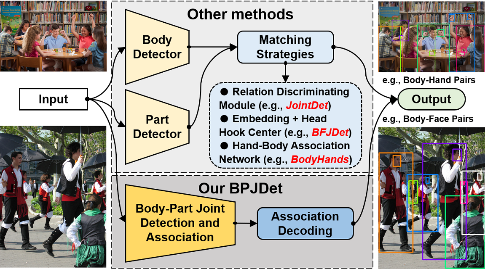
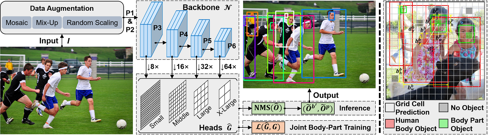

# BPJDet
Codes for my paper "[Body-Part Joint Detection and Association via Extended Object Representation](https://arxiv.org/abs/2212.07652)" accepted by ICME2023

* [**2023-06-13**] We have released all pretrained models of both new tasks: `body-parts joint detection` and `body-hand joint detection and hand contact estimation` in [Hugging Face](https://huggingface.co/HoyerChou/BPJDet#bpjdetplus).
* [**2023-06-13**] We have released a new branch [BPJDetPlus](https://github.com/hnuzhy/BPJDet/tree/BPJDetPlus) for the journal verison with updated code and detailed descriptions. It has various new functions (`Multiple Body-Parts Joint Detection` and two downstream applications including `Body-Head for Accurate Crowd Counting` and `Body-Hand for Hand Contact Estimation`). Please feel free to follow it!
* [**2023-04-24**] The extended journal version of our conference paper is released in [BPJDet: Extended Object Representation for Generic Body-Part Joint Detection](https://arxiv.org/abs/2304.10765)
* [**2023-03-15**] We have decided to release our BPJDet-S/M/L pretrained models on CrowdHuman and BodyHands in [Hugging Face](https://huggingface.co/HoyerChou/BPJDet). Please follow the [[Inference](#inference)] section to test on your own images/videos.

<table>
<tr>
<th> Body-Head Demo 1 (no tracking) </th>
<th> Body-Head Demo 2 (no tracking) </th>
</tr>
<tr>
<td></td>
<td></td> 
</tr>
</table>

## Paper Abstract
> The detection of human body and its related parts (e.g., face, head or hands) have been intensively studied and greatly improved since the breakthrough of deep CNNs. However, most of these detectors are trained independently, making it a challenging task to associate detected body parts with people. This paper focuses on the problem of joint detection of human body and its corresponding parts. Specifically, we propose a novel extended object representation that integrates the center location offsets of body or its parts, and construct a dense single-stage anchor-based Body-Part Joint Detector (BPJDet). Body-part associations in BPJDet are embedded into the unified representation which contains both the semantic and geometric information. Therefore, BPJDet does not suffer from error-prone association post-matching, and has a better accuracy-speed trade-off. Furthermore, BPJDet can be seamlessly generalized to jointly detect any body part. To verify the effectiveness and superiority of our method, we conduct extensive experiments on the CityPersons, CrowdHuman and BodyHands datasets. The proposed BPJDet detector achieves state-of-the-art association performance on these three benchmarks while maintains high accuracy of detection.

## Table of contents
<!--ts-->
- [Illustrations](#illustrations)
- [Installation](#installation)
- [Dataset Preparing](#dataset-preparing)
  * [CityPersons](#citypersons)
  * [CrowdHuman](#crowdhuman)
  * [BodyHands](#bodyhands)
- [Training and Testing](#training-and-testing)
  * [Configs](#configs)
  * [Body-Face Task](#body-face-task)
  * [Body-Hand Task](#body-hand-task)
  * [Body-Head Task](#body-head-task)
- [Inference](#inference)
- [References](#references)
- [Licenses](#licenses) 
- [Citation](#citation)
<!--te-->


## Illustrations

* **Fig. 1.** The illustration of the difference between our proposed single-stage BPJDet and other two-stage body-part joint detection methods.


* **Fig. 2.** **Left:** Our BPJDet adopts YOLOv5 as the backbone. **Right:** Examples for grid cell predictions with human body objects in red color and body part objects (e.g., face) in green color.



## Installation

* **Environment:** Anaconda, Python3.8, PyTorch1.10.0(CUDA11.2), wandb
```bash
$ git clone https://github.com/hnuzhy/BPJDet.git
$ pip install -r requirements.txt -i https://pypi.tuna.tsinghua.edu.cn/simple

# Codes are only evaluated on GTX3090 + CUDA11.2 + PyTorch1.10.0.
$ pip3 install torch==1.10.0+cu111 torchvision==0.11.1+cu111 torchaudio==0.10.0+cu111 \
  -f https://download.pytorch.org/whl/cu111/torch_stable.html
```

## Dataset Preparing

### CityPersons
* [CityPersons](https://arxiv.org/abs/1702.05693) is a new set of person annotations on top of the [Cityscapes](https://www.cityscapes-dataset.com/) dataset.
* Download images of CityPersons from Cityscapes website https://www.cityscapes-dataset.com/.
* Download annotations from [GoogleDrive](https://drive.google.com/drive/folders/1PxGTo_SE8O56r0qw7DgmR3Lk-eokS0X0), which contains the original body boxes and newly annotated head/face boxes by [BFJDet](https://github.com/AibeeDetect/BFJDet#data-preparing). You will get three json files from the ground-truth folder `instances_train_bhfmatch_new.json`, `instances_val_bhfmatch_new.json` and `instances_val_bf_new.json`.
* Process new annotations of CityPersons provided by BFJDet for our BPJDet task by running `python tools/get_anno_CityPersons.py`.
```bash
# Dataset info stat after processing:
original images [train:val] = [2415:500](2915), and instances [train:val] = [22169:5185]
[person]    (images --> train:val=1847:361, total 2208, instances --> train:val=14762:3439, total 18201)
[head]      (images --> train:val=1847:361, total 2208, instances --> train:val=14554:3400, total 17954)
[face]      (images --> train:val=1846:361, total 2207, instances --> train:val= 6487:1435, total  7922)
```

### CrowdHuman
* [CrowdHuman](https://www.crowdhuman.org/) is a benchmark dataset focusing on human to better evaluate detectors in crowd scenarios.
* Download images of CrowdHuman from website http://www.crowdhuman.org/.
* Download annotations from [GoogleDrive](https://drive.google.com/drive/folders/1Sk2IAmm_wTVh289RKs5FiU17siWrJJCu), which contains the original body/head boxes and newly annotated face boxes by [BFJDet](https://github.com/AibeeDetect/BFJDet#data-preparing). You will get two json files `instances_train_full_bhf_new.json` and `instances_val_full_bhf_new.json`.
* Process new annotations of CrowdHuman provided by BFJDet for our BPJDet task by running `python tools/get_anno_CrowdHuman.py`.
```bash
# Dataset info stat after processing:
original images [train:val] = [15000:4370](2915), and instances [train:val] = [438792:127716](566508)
[person]    (images --> train:val=15000:4370, instances --> train:val=339565:99481 (439046))
[head]      (images --> train:val=15000:4370, instances --> train:val=339565:99481 (439046))
[face]      (images --> train:val=14690:4282, instances --> train:val=191575:57328 (248903))
```

### BodyHands
* [BodyHands](http://vision.cs.stonybrook.edu/~supreeth/BodyHands/) is a large-scale dataset, and has images with annotations for hand and body locations and their correspondences.
* Download images and annotations of BodyHands from website http://vision.cs.stonybrook.edu/~supreeth/BodyHands/.
* The original using and training of BodyHands are in https://github.com/cvlab-stonybrook/BodyHands.
* Process official annotations of BodyHands for our BPJDet task by running `python tools/get_anno_BodyHands.py`.
```bash
# Dataset info stat after processing:
original images [train:val] = [18858:1629](20487), and instances [train:val] = [56060:7048](63108)
[person]    (images --> train:val=18858:1629, instances --> train:val=56060:7048 (63108))
[hand]      (images --> train:val=18858:1629, instances --> train:val=51901:5983 (57884))
```


## Training and Testing

### Configs
* **Yaml:** Please refer these `./data/*.yaml` files to config your own .yaml file. Such as the `JointBP_BodyHands.yaml` file for body-hand joint detection task.

* **Pretrained weights:** For YOLOv5 weights, please download the version 5.0 that we have used. And put them under the `./weights/` folder
```
yolov5s6.pt [https://github.com/ultralytics/yolov5/releases/download/v5.0/yolov5s6.pt]
yolov5m6.pt [https://github.com/ultralytics/yolov5/releases/download/v5.0/yolov5m6.pt]
yolov5l6.pt [https://github.com/ultralytics/yolov5/releases/download/v5.0/yolov5l6.pt]
```

### Body-Face Task

* preparing yolov5-style labels for body-face
```bash
# for CityPersons
$ rm -rf /path/to/dataset/CityPersons/yolov5_style_face/
$ cd /path/to/project/BPJDet
$ python utils/labels.py --data data/JointBP_CityPersons_face.yaml
# for CrowdHuman
$ rm -rf /path/to/dataset/CrowdHuman/yolov5_style_face/
$ cd /path/to/project/BPJDet
$ python utils/labels.py --data data/JointBP_CrowdHuman_face.yaml
```

* BPJDet-S (on CityPersons)
```bash
# training (using --noval for faster training)
$ python -m torch.distributed.launch --nproc_per_node 2 train.py --workers 10 --device 0,1 \
    --data data/JointBP_CityPersons_face.yaml --hyp data/hyp-p6.yaml --val-scales 1 --val-flips -1 \
    --weights weights/yolov5s6.pt --project runs/BPJDet --img 1536 --batch 24 --epochs 100 \
    --body_part_w 0.015 --name cps_face_s_1536_e100_mMR --noval
# testing (w/o TTA)
$ python val.py --rect --data data/JointBP_CityPersons_face.yaml --img 1536 \
    --weights runs/JointBP/cps_face_s_1536_e100_mMR/weights/best_mMR.pt \
    --batch-size 8 --device 3
# result
[mMR_all_list]: Reasonable: 0.293, Bare: 0.293, Partial: 0.289, Heavy: 0.572
```
* BPJDet-S (on CrowdHuman)
```bash
# training (using --noval for faster training)
$ python -m torch.distributed.launch --nproc_per_node 3 train.py --workers 15 --device 0,1,2 \
    --data data/JointBP_CrowdHuman_face.yaml --hyp data/hyp-p6.yaml --val-scales 1 --val-flips -1 \
    --weights weights/yolov5s6.pt --project runs/BPJDet --img 1536 --batch 45 --epochs 150 \
    --body_part_w 0.015 --name ch_face_s_1536_e150_mMR --noval
# testing (w/o TTA)
$ python val.py --rect --data data/JointBP_CrowdHuman_face.yaml --img 1536 \
    --weights runs/BPJDet/ch_face_s_1536_e150_mMR/weights/best_mMR.pt \
    --batch-size 8 --device 3
# result
[AP@.5&MR]: AP_body: 0.895, AP_part: 0.808, MR_body: 0.413, MR_part: 0.459, mMR_avg: 0.668
[mMR_list]: Reasonable: 0.514, Small: 0.711, Heavy: 0.838, All: 0.607
```

* BPJDet-M (on CityPersons)
```bash
# training (using --noval for faster training)
$ python -m torch.distributed.launch --nproc_per_node 2 train.py --workers 10 --device 0,1 \
    --data data/JointBP_CityPersons_face.yaml --hyp data/hyp-p6.yaml --val-scales 1 --val-flips -1 \
    --weights weights/yolov5m6.pt --project runs/BPJDet --img 1536 --batch 20 --epochs 100 \
    --body_part_w 0.015 --name cps_face_m_1536_e100_mMR --noval
# testing (w/o TTA)
$ python val.py --rect --data data/JointBP_CityPersons_face.yaml --img 1536 \
    --weights runs/BPJDet/cps_face_m_1536_e100_mMR/weights/best_mMR.pt \
    --batch-size 8 --device 3
# result
[mMR_all_list]: Reasonable: 0.275, Bare: 0.249, Partial: 0.316, Heavy: 0.558
```
* BPJDet-M (on CrowdHuman)
```bash
# training (using --noval for faster training)
$ python -m torch.distributed.launch --nproc_per_node 3 train.py --workers 15 --device 0,1,2 \
    --data data/JointBP_CrowdHuman_face.yaml --hyp data/hyp-p6.yaml --val-scales 1 --val-flips -1 \
    --weights weights/yolov5m6.pt --project runs/BPJDet --img 1536 --batch 30 --epochs 150 \
    --body_part_w 0.015 --name ch_face_m_1536_e150_mMR --noval
# testing (w/o TTA)
$ python val.py --rect --data data/JointBP_CrowdHuman_face.yaml --img 1536 \
    --weights runs/BPJDet/ch_face_m_1536_e150_mMR/weights/best_mMR.pt \
    --batch-size 8 --device 3
# result
[AP@.5&MR]: AP_body: 0.907, AP_part: 0.822, MR_body: 0.397, MR_part: 0.450, mMR_avg: 0.662
[mMR_list]: Reasonable: 0.506, Small: 0.692, Heavy: 0.844, All: 0.607
```

* BPJDet-L (on CityPersons)
```bash
# training (using --noval for faster training)
$ python -m torch.distributed.launch --nproc_per_node 2 train.py --workers 10 --device 0,1 \
    --data data/JointBP_CityPersons_face.yaml --hyp data/hyp-p6.yaml --val-scales 1 --val-flips -1 \
    --weights weights/yolov5l6.pt --project runs/BPJDet --img 1536 --batch 12 --epochs 100 \
    --body_part_w 0.015 --name cps_face_l_1536_e100_mMR --noval
# testing (w/o TTA)
$ python val.py --rect --data data/JointBP_CityPersons_face.yaml --img 1536 \
    --weights runs/BPJDet/cps_face_l_1536_e100_mMR/weights/best_mMR.pt \
    --batch-size 6 --device 3
# result
[mMR_all_list]: Reasonable: 0.264, Bare: 0.255, Partial: 0.277, Heavy: 0.462
```
* BPJDet-L (on CrowdHuman)
```bash
# training (using --noval for faster training)
$ python -m torch.distributed.launch --nproc_per_node 3 train.py --workers 15 --device 0,1,2 \
    --data data/JointBP_CrowdHuman_face.yaml --hyp data/hyp-p6.yaml --val-scales 1 --val-flips -1 \
    --weights weights/yolov5l6.pt --project runs/BPJDet --img 1536 --batch 18 --epochs 150 \
    --body_part_w 0.015 --name ch_face_l_1536_e150_mMR --noval
# testing (w/o TTA)
$ python val.py --rect --data data/JointBP_CrowdHuman_face.yaml --img 1536 \
    --weights runs/BPJDet/ch_face_l_1536_e150_mMR/weights/best_mMR.pt \
    --batch-size 8 --device 3
# result
[AP@.5&MR]: AP_body: 0.895, AP_part: 0.816, MR_body: 0.407, MR_part: 0.463, mMR_avg: 0.657
[mMR_list]: Reasonable: 0.501, Small: 0.688, Heavy: 0.834, All: 0.604
```


### Body-Hand Task

* preparing yolov5-style labels for body-hand
```bash
$ rm -rf /path/to/dataset/BodyHands/yolov5_style_hand/
$ cd /path/to/project/BPJDet
$ python utils/labels.py --data data/JointBP_BodyHands.yaml
```

* BPJDet-S (on BodyHands)
```bash
# training (using --noval for faster training)
$ python -m torch.distributed.launch --nproc_per_node 3 train.py --workers 15 --device 0,1,2 \
    --data data/JointBP_BodyHands.yaml --hyp data/hyp-p6.yaml --val-scales 1 --val-flips -1 \
    --weights weights/yolov5s6.pt --project runs/BPJDet --img 1536 --batch 45 --epochs 100 \
    --body_part_w 0.015 --name bh_hand_s_1536_e100 --noval
# testing (w/o TTA)
$ python val.py --rect --data data/JointBP_BodyHands.yaml --img 1536 \
    --weights runs/BPJDet/bh_hand_s_1536_e100/weights/best.pt --batch-size 8 --device 3
# result
###### bodypart bbox mAP: 8063
 Average Precision  (AP) @[ IoU=0.50      | area=   all | maxDets=100 ] = 0.840
Body Accuracy corresponding to Dual Metric is: 85.6762
AP_Dual(Joint-AP): 77.856, AP_Single: 62.743
```

* BPJDet-M (on BodyHands)
```bash
# training (using --noval for faster training)
$ python -m torch.distributed.launch --nproc_per_node 3 train.py --workers 15 --device 0,1,2 \
    --data data/JointBP_BodyHands.yaml --hyp data/hyp-p6.yaml --val-scales 1 --val-flips -1 \
    --weights weights/yolov5m6.pt --project runs/BPJDet --img 1536 --batch 30 --epochs 100 \
    --body_part_w 0.015 --name bh_hand_m_1536_e100 --noval
# testing (w/o TTA)
$ python val.py --rect --data data/JointBP_BodyHands.yaml --img 1536 \
    --weights runs/BPJDet/bh_hand_m_1536_e100/weights/best.pt --batch-size 8 --device 3
# result
###### bodypart bbox mAP: 8077
 Average Precision  (AP) @[ IoU=0.50      | area=   all | maxDets=100 ] = 0.853
Body Accuracy corresponding to Dual Metric is: 86.8009
AP_Dual(Joint-AP): 78.133, AP_Single: 63.243
```

* BPJDet-L (on BodyHands)
```bash
# training (using --noval for faster training)
$ python -m torch.distributed.launch --nproc_per_node 3 train.py --workers 15 --device 0,1,2 \
    --data data/JointBP_BodyHands.yaml --hyp data/hyp-p6.yaml --val-scales 1 --val-flips -1 \
    --weights weights/yolov5l6.pt --project runs/BPJDet --img 1536 --batch 18 --epochs 100 \
    --body_part_w 0.015 --name bh_hand_l_1536_e100 --noval
# testing (w/o TTA)
$ python val.py --rect --data data/JointBP_BodyHands.yaml --img 1536 \
    --weights runs/BPJDet/bh_hand_l_1536_e100/weights/best.pt --batch-size 8 --device 3 
# result
###### bodypart bbox mAP: 8184
 Average Precision  (AP) @[ IoU=0.50      | area=   all | maxDets=100 ] = 0.859
Body Accuracy corresponding to Dual Metric is: 86.905
AP_Dual(Joint-AP): 84.385, AP_Single: 63.589
```


### Body-Head Task

* preparing yolov5-style labels for body-head
```bash
$ rm -rf /path/to/dataset/CrowdHuman/yolov5_style_head/
$ cd /path/to/project/BPJDet
$ python utils/labels.py --data data/JointBP_CrowdHuman_head.yaml
```

* BPJDet-S (on CrowdHuman)
```bash
# training (using --noval for faster training)
$ python -m torch.distributed.launch --nproc_per_node 3 train.py --workers 15 --device 0,1,2 \
    --data data/JointBP_CrowdHuman_head.yaml --hyp data/hyp-p6.yaml --val-scales 1 --val-flips -1 \
    --weights weights/yolov5s6.pt --project runs/BPJDet --img 1536 --batch 45 --epochs 150 \
    --body_part_w 0.015 --name ch_head_s_1536_e150_mMR --noval
# testing (w/o TTA)
$ python val.py --rect --data data/JointBP_CrowdHuman_head.yaml --img 1536 \
    --weights runs/BPJDet/ch_head_s_1536_e150_mMR/weights/best_mMR.pt --batch-size 8 --device 3
# result
[AP@.5&MR]: AP_body: 0.824, AP_part: 0.771, MR_body: 0.459, MR_part: 0.478, mMR_avg: 0.661
[mMR_list]: Reasonable: 0.480, Small: 0.613, Heavy: 0.869, All: 0.682
```

* BPJDet-M (on CrowdHuman)
```bash
# training (using --noval for faster training)
$ python -m torch.distributed.launch --nproc_per_node 3 train.py --workers 15 --device 0,1,2 \
    --data data/JointBP_CrowdHuman_head.yaml --hyp data/hyp-p6.yaml --val-scales 1 --val-flips -1 \
    --weights weights/yolov5m6.pt --project runs/BPJDet --img 1536 --batch 30 --epochs 150 \
    --body_part_w 0.015 --name ch_head_m_1536_e150_mMR --noval
# testing (w/o TTA)
$ python val.py --rect --data data/JointBP_CrowdHuman_head.yaml --img 1536 \
    --weights runs/BPJDet/ch_head_m_1536_e150_mMR/weights/best_mMR.pt --batch-size 8 --device 3
# result
[AP@.5&MR]: AP_body: 0.828, AP_part: 0.777, MR_body: 0.454, MR_part: 0.468, mMR_avg: 0.648
[mMR_list]: Reasonable: 0.461, Small: 0.596, Heavy: 0.869, All: 0.665
```

* BPJDet-L (on CrowdHuman)
```bash
# training (using --noval for faster training)
$ python -m torch.distributed.launch --nproc_per_node 3 train.py --workers 15 --device 0,1,2 \
    --data data/JointBP_CrowdHuman_head.yaml --hyp data/hyp-p6.yaml --val-scales 1 --val-flips -1 \
    --weights weights/yolov5l6.pt --project runs/BPJDet --img 1536 --batch 18 --epochs 150 \
    --body_part_w 0.015 --name ch_head_l_1536_e150_mMR
# testing (w/o TTA)
$ python val.py --rect --data data/JointBP_CrowdHuman_head.yaml --img 1536 \
    --weights runs/BPJDet/ch_head_l_1536_e150_mMR/weights/best_mMR.pt --batch-size 8 --device 3
# result
[AP@.5&MR]: AP_body: 0.811, AP_part: 0.761, MR_body: 0.462, MR_part: 0.480, mMR_avg: 0.645
[mMR_list]: Reasonable: 0.464, Small: 0.582, Heavy: 0.864, All: 0.670
```


## Inference

* For single image or multiple images under one folder using `./demos/image.py`
```bash
# single image. Taking body-head joint detection as an example.
$ python demos/image.py --weights runs/BPJDet/ch_head_l_1536_e150_mMR/weights/best_mMR.pt \
    --data data/JointBP_CrowdHuman_head.yaml --imgsz 1536 --conf-thres 0.45 --iou-thres 0.75 \
    --match-iou 0.6 --img-path test_imgs/CrowdHuman/273271,1e59400094ef5d82.jpg --device 3
$ python demos/image.py --weights runs/BPJDet/ch_head_l_1536_e150_mMR/weights/best_mMR.pt \
    --data data/JointBP_CrowdHuman_head.yaml --imgsz 1536 --conf-thres 0.45 --iou-thres 0.75 \
    --match-iou 0.6 --img-path test_imgs/COCO/000000567640.jpg --device 3
$ python demos/image.py --weights runs/BPJDet/ch_head_l_1536_e150_mMR/weights/best_mMR.pt \
    --data data/JointBP_CrowdHuman_head.yaml --imgsz 1536 --conf-thres 0.45 --iou-thres 0.75 \
    --match-iou 0.6 --img-path test_imgs/BodyHands/test_4507_1.jpg --device 3

# multiple images. Taking body-head joint detection as an example.
$ python demos/image.py --weights runs/BPJDet/ch_head_l_1536_e150_mMR/weights/best_mMR.pt \
    --data data/JointBP_CrowdHuman_head.yaml --imgsz 1536 --conf-thres 0.45 --iou-thres 0.75 \
    --match-iou 0.6 --img-path test_imgs/CrowdHuman/ --device 3
$ python demos/image.py --weights runs/BPJDet/ch_head_l_1536_e150_mMR/weights/best_mMR.pt \
    --data data/JointBP_CrowdHuman_head.yaml --imgsz 1536 --conf-thres 0.45 --iou-thres 0.75 \
    --match-iou 0.6 --img-path test_imgs/COCO/ --device 3
$ python demos/image.py --weights runs/BPJDet/ch_head_l_1536_e150_mMR/weights/best_mMR.pt \
    --data data/JointBP_CrowdHuman_head.yaml --imgsz 1536 --conf-thres 0.45 --iou-thres 0.75 \
    --match-iou 0.6 --img-path test_imgs/BodyHands/ --device 3
```

* For single video using `./demos/video.py`. Taking body-head joint detection as an example.
```bash
# save as .mp4 file
$ python demos/video.py --weights runs/BPJDet/ch_head_l_1536_e150_mMR/weights/best_mMR.pt \
    --data data/JointBP_CrowdHuman_head.yaml --video-path test_imgs/path/to/file.mp4 \
    --imgsz 1536 --conf-thres 0.25 --iou-thres 0.75 --match-iou 0.6 --device 3 \
    --start 0 --end -1 --thickness 2 --alpha 0.2 --save-size 540

# save as .gif file
$ python demos/video.py --weights runs/BPJDet/ch_head_l_1536_e150_mMR/weights/best_mMR.pt \
    --data data/JointBP_CrowdHuman_head.yaml --video-path test_imgs/path/to/file.mp4 \
    --imgsz 1536 --conf-thres 0.25 --iou-thres 0.75 --match-iou 0.6 --device 3 \
    --start 0 --end -1 --thickness 2 --alpha 0.2 --gif --gif-size 640 360
```


## References

* [YOLOv5 🚀 in PyTorch > ONNX > CoreML > TFLite](https://github.com/ultralytics/yolov5)
* [ICCV 2021 (BFJDet) - Body-Face Joint Detection via Embedding and Head Hook](https://github.com/AibeeDetect/BFJDet)
* [CVPR 2022 (BodyHands) - Whose Hands Are These? Hand Detection and Hand-Body Association in the Wild](https://github.com/cvlab-stonybrook/BodyHands)
* We also thank public datasets [CityPersons](https://www.cityscapes-dataset.com/), [CrowdHuman](https://www.crowdhuman.org/) and [COCOPersons](https://cocodataset.org/) for their excellent works.


## Licenses

Our work is based on public code and datasets. If you plan to add our work to your business project, please obtain the following enterprise licenses.
* **BPJDet:** GNU General Public License v3.0 (GPL-3.0 License): See [LICENSE](./LICENSE.txt) file for details. 
* **YOLOv5:** To request an Enterprise License please complete the form at [Ultralytics Licensing](https://ultralytics.com/license)


## Citation

If you use our works in your research, please cite with:
```
@article{zhou2022body,
  title={Body-Part Joint Detection and Association via Extended Object Representation},
  author={Zhou, Huayi and Jiang, Fei and Lu, Hongtao},
  journal={arXiv preprint arXiv:2212.07652},
  year={2022}
}
```
